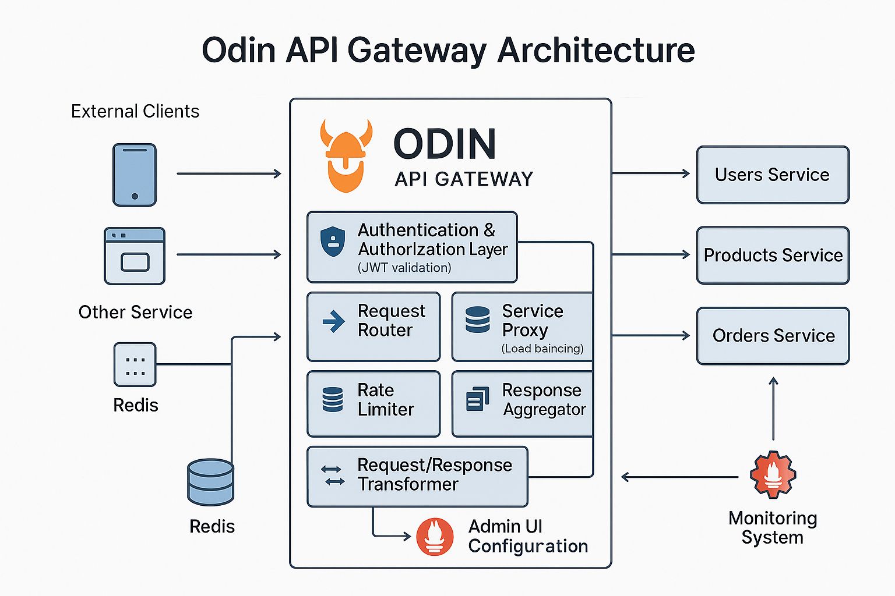
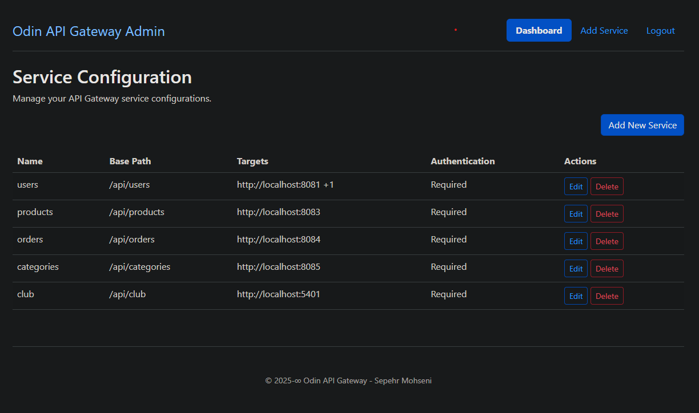
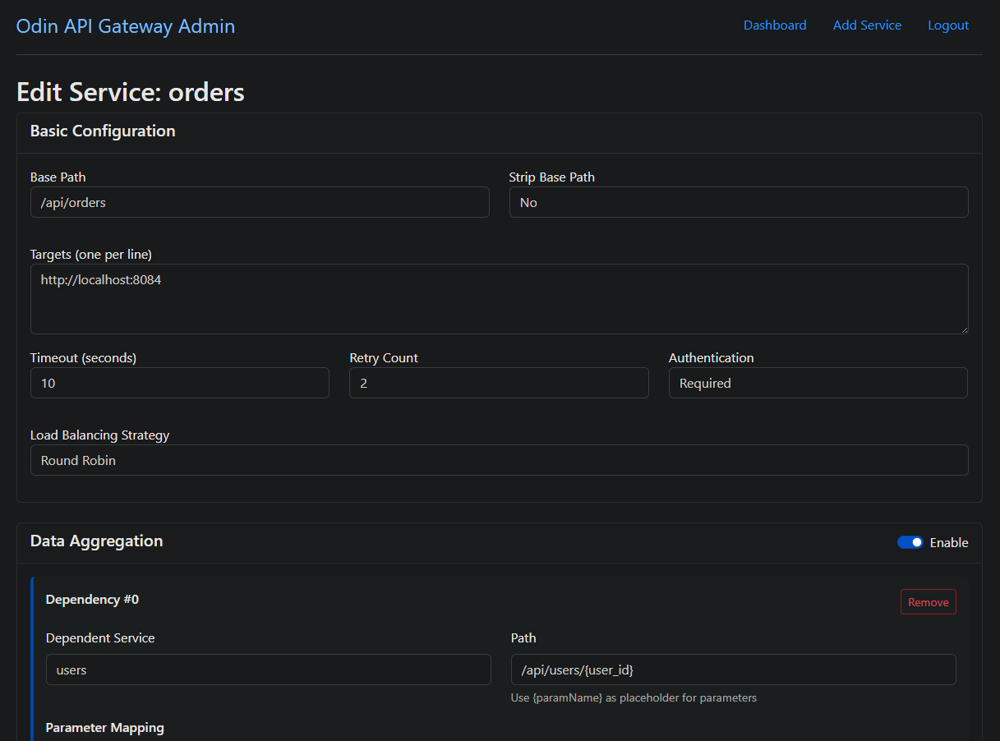

# Odin API Gateway


Odin is a high-performance, feature-rich API Gateway built in Go. It serves as a central entry point for managing microservice architectures with features like request routing, authentication, response aggregation, and more.

## ✨ Features



- **Dynamic Service Routing** - Route requests to the appropriate backend services
- **Authentication & Authorization** - Secure your APIs with JWT-based access control
- **Response Aggregation** - Combine responses from multiple services into a single response
- **Request Transformation** - Modify requests and responses with JSONPath transformations
- **Load Balancing** - Distribute requests across multiple service instances
- **Monitoring & Metrics** - Prometheus metrics for observability
- **Caching** - Reduce backend load with response caching
- **Rate Limiting** - Protect your services from overuse
- **Admin UI** - Web-based configuration interface

## 🚀 Getting Started

### Prerequisites

- Go 1.24 or later
- Docker and Docker Compose (optional, for containerized deployment)

### Installation

```bash
# Clone the repository
git clone https://github.com/sepehr-mohseni/odin.git
cd odin

# Install dependencies
go mod download

# Build the gateway
go build -o bin/odin cmd/odin/main.go
```

### Quick Start

```bash
# Copy the example configuration
cp config/default_config.yaml config/config.yaml
cp config/auth_secrets.yaml.example config/auth_secrets.yaml

# Start the gateway
./bin/odin --config config/config.yaml
```

## 📖 Documentation

Comprehensive documentation is available in the [docs](./docs) directory:

- [Installation Guide](./docs/installation.md)
- [Configuration Guide](./docs/configuration.md)
- [Deployment Guide](./docs/deployment.md)
- [Authentication](./docs/auth.md)
- [Response Transformation](./docs/transformation.md)
- [Response Aggregation](./docs/aggregation.md)
- [Monitoring](./docs/monitoring.md)
- [Project Structure](./docs/project-structure.md)



## 🧪 Testing

Run the test suite:

```bash
go test ./...
```

To run the API gateway test script:

```bash
cd test
./test-api-gateway.sh
```

## 📦 Docker

```bash
# Build the docker image
docker build -t odin-gateway:latest .

# Run the container
docker run -p 8080:8080 -p 8081:8081 -v $(pwd)/config:/app/config odin-gateway:latest
```



## 🤝 Contributing

Contributions are welcome! Please see our [Contributing Guide](./CONTRIBUTING.md) for more details.

## 📄 License

This project is licensed under the MIT License - see the [LICENSE](./LICENSE) file for details.

## 🔗 Links

- [Project Roadmap](./ROADMAP.md)
- [Security Policy](./SECURITY.md)
- [Code of Conduct](./CODE_OF_CONDUCT.md)
